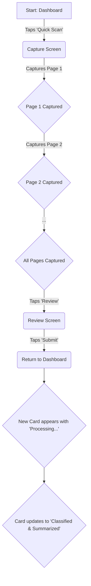
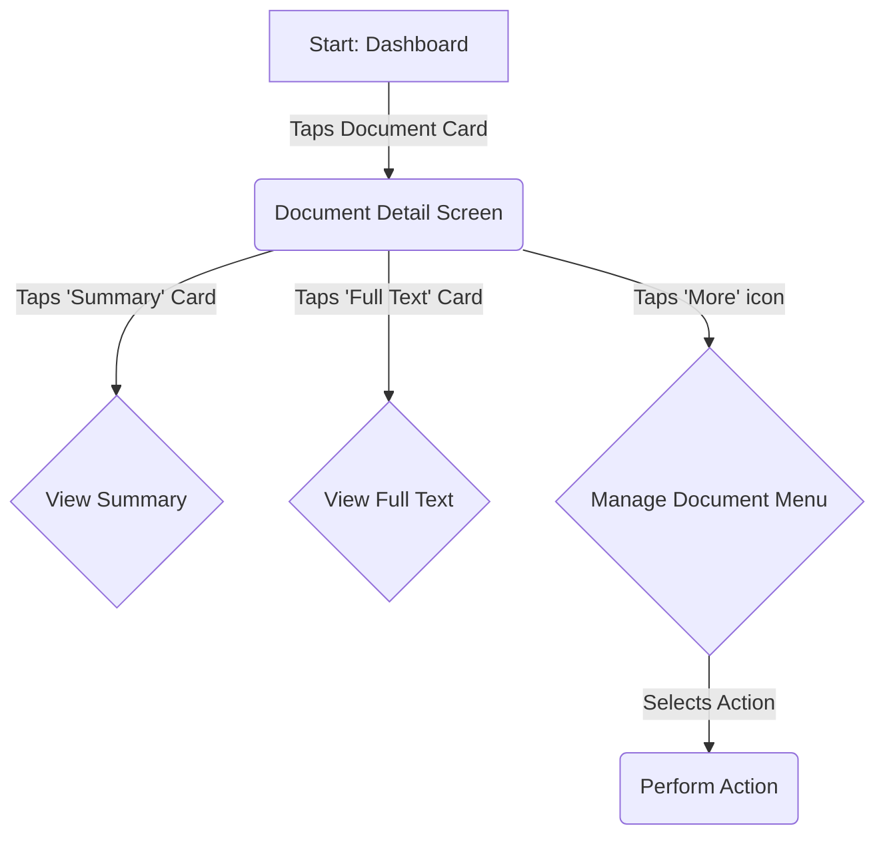

# LawAI UX Design Specification

_Created on 2025-11-06 by qninhdt_
_Generated using BMad Method - Create UX Design Workflow v1.0_

---

## Executive Summary

An AI-powered mobile app to make digitizing and understanding Vietnamese legal documents comfortable and effortless.

---

## 1. Design System Foundation

### 1.1 Design System Choice

**Chosen Design System:** shadcn/ui

**Rationale:** The project's PRD specifies shadcn/ui, which is an excellent choice for LawAI. It provides a collection of high-quality, reusable React components built on Radix UI and styled with Tailwind CSS. This approach offers:

*   **Modern & Customizable:** Allows for extensive theming and styling, ensuring a unique and professional look consistent with LawAI's brand.
*   **Accessible:** Components are designed with accessibility in mind, leveraging Radix for features like keyboard navigation and ARIA attributes, which is crucial for making LawAI usable by everyone.
*   **Developer-Friendly:** Its code-ownership model gives developers full control and transparency, speeding up development and integration.
*   **AI-Ready:** The open code and consistent API make it well-suited for future AI-powered development tools.

This establishes a robust and flexible component foundation for LawAI.

---

## 2. Core User Experience

### 2.1 Defining Experience

**Defining Experience:** The app that instantly transforms Vietnamese legal documents—whether from a file or a photo—into intelligent, easy-to-manage digital records.

**Rationale:** This encompasses the core value proposition of LawAI, highlighting both document acquisition (file/camera) and the AI-powered transformation into intelligent, manageable digital assets. It emphasizes the ease and efficiency users will experience.

**Core Experience Principles:**

*   **Effortless Capture:** Getting documents into the system, whether by file upload or camera scanning, should be incredibly simple, fast, and forgiving.
*   **Instant Intelligence:** The AI-powered analysis (OCR, summary, classification) should happen automatically in the background, presenting clear and valuable results without the user needing to be an expert.
*   **Comfortable Control:** Users should feel in control of their documents and the information presented to them, with an interface that is calm, organized, and never overwhelming.
*   **Clarity and Trust:** The design will be clean, the language simple (even for legal topics), and the system's actions will be transparent, building user trust.

### 2.2 Novel UX Patterns

{{novel_ux_patterns}}

---

## 3. Visual Foundation

### 3.1 Color System

**Color Palette:**

LawAI will utilize a minimalist color palette centered around a single primary blue, complemented by black, white, and a range of neutral grays. This approach emphasizes clarity, professionalism, and a focused user experience.

*   **Primary Accent Color:** `#0047AB` (Serious Blue) - Used for primary calls to action, key interactive elements, and branding accents. This color evokes trust, stability, and professionalism.
*   **Text Colors:**
    *   Dark Text: `#212529` (Near Black) - For primary content, headings, and high-contrast text on light backgrounds.
    *   Light Text: `#FFFFFF` (White) - For text on dark backgrounds or over the primary accent color.
*   **Backgrounds:**
    *   Light Mode: `#FFFFFF` (White) - Clean, spacious backgrounds.
    *   Dark Mode: `#1A1A1A` (Very Dark Gray) - For a comfortable, low-light viewing experience.
*   **Neutrals (Grays):** A carefully selected scale of grays will be used for secondary text, borders, dividers, disabled states, and subtle background variations to maintain visual hierarchy without introducing additional hues.
*   **Semantic Colors:** (These are functional and distinct from the brand color to ensure clear communication of status.)
    *   Success: `#28A745` (Green)
    *   Error: `#DC3545` (Red)
    *   Warning: `#FFC107` (Amber)
    *   Info: `#17A2B8` (Cyan)

**Typography System:**

*   **Font Family:** 'Inter', sans-serif - A modern, highly readable, and versatile sans-serif typeface that performs well across various screen sizes and resolutions. It aligns with the clean and efficient aesthetic of LawAI.
*   **Type Scale:** We will leverage `shadcn/ui`'s default type scale, which provides a well-balanced hierarchy for headings, body text, and smaller elements, ensuring optimal readability and visual flow.
*   **Font Weights:** Regular (400), Semibold (600), and Bold (700) will be used to establish clear visual hierarchy and emphasize important information.

**Spacing and Layout Foundation:**

*   **Base Unit:** A **4px grid system** will be adopted for all spacing, padding, and margin values. This systematic approach ensures consistency, scalability, and precise alignment across the entire application.
*   **Spacing Scale:** We will utilize `shadcn/ui`'s inherent spacing scale (e.g., `p-1` for 4px, `p-2` for 8px, `p-4` for 16px, etc.) to maintain a harmonious visual rhythm.
*   **Layout Grid:** A flexible, responsive grid system, as provided by `shadcn/ui` and Tailwind CSS, will be used to ensure optimal content arrangement and adaptability across different screen sizes (mobile, tablet, desktop).

**Interactive Visualizations:**

- Color Theme Explorer: [ux-color-themes.html](./ux-color-themes.html)

---

## 4. Design Direction

### 4.1 Chosen Design Approach

**Chosen Design Direction:** Direction 3: Guided & Progressive

**Rationale:** This direction was selected because it best aligns with the core experience principles of "Comfortable Control" and "Clarity and Trust." Its friendly, step-by-step approach is ideal for making the potentially complex task of legal document scanning feel simple and reliable for all users.

*   **Friendly & Approachable:** The guided flow reduces cognitive load and makes the application feel supportive, directly contributing to the desired emotional response of "comfortable."
*   **Builds Trust:** Clear status indicators for background processes (e.g., "Processing...", "Classified & Summarized") provide transparent feedback, which is crucial for building user confidence in the AI's functionality.
*   **Progressive Disclosure:** Information is presented in manageable chunks (e.g., summary cards, then full text), preventing users from feeling overwhelmed.

This approach prioritizes a smooth onboarding and a supportive experience for first-time and non-expert users, which is critical for LawAI's success.

**Interactive Mockups:**

- Design Direction Showcase: [ux-design-directions.html](./ux-design-directions.html)

---

## 5. User Journey Flows

### 5.1 Critical User Paths

Based on the chosen "Guided & Progressive" design direction, the following two user journeys are critical to LawAI's success.

#### Journey 1: Mobile Camera Document Upload

*   **User Goal:** To easily and accurately capture a multi-page physical document and submit it for analysis.
*   **Approach:** A guided, step-by-step process that builds confidence and ensures high-quality captures.

**Flow Steps:**

1.  **Entry:** User taps a prominent "Quick Scan" button from the main dashboard.
2.  **Capture Screen:** The camera view opens with a clear overlay guiding the user to position the document. A "Page 1 of 10" indicator is visible.
3.  **Capture & Feedback:** Upon capturing a page, a thumbnail appears, and the indicator updates to "Page 2 of 10." This provides immediate, positive feedback.
4.  **Multi-page Flow:** The user continues capturing pages, with each new thumbnail added to a gallery, reinforcing their progress.
5.  **Review & Submit:** After capturing, the user can review all pages in a simple grid, reorder them via drag-and-drop, or delete any poor captures. They then tap "Submit."
6.  **Processing Feedback:** The user is returned to the dashboard, where a new document card instantly appears at the top with a "Processing..." status and a visual progress bar. This transparency is crucial for building trust in the AI.
7.  **Success:** Once processing is complete, the card updates to show the document title, its classification (e.g., "Decree"), and a "Classified & Summarized" status. A subtle notification may also appear to bring the user's attention to the completed task.

**Flow Diagram:**

#### Journey 2: Document Review and Management

*   **User Goal:** To find, review, and understand a processed document.
*   **Approach:** A card-based interface with progressive disclosure to prevent information overload.

**Flow Steps:**

1.  **Entry:** The user opens the app to the dashboard, which serves as their document list.
2.  **Find Document:** The user sees a list of their documents, presented as cards with clear titles, classifications, and dates. They can scroll or use a search bar to find a specific document.
3.  **Document Detail:** Upon tapping a document card, the user is taken to the Document Detail screen. This screen presents the document's information in digestible, card-based chunks: "Summary," "Classification," "Full Text," etc.
4.  **View Summary:** The user taps the "Summary" card, which expands in-place to show the AI-generated summary, rendered from **Markdown** format.
5.  **View Full Text:** The user can then choose to view the full OCR'd text, which would open in a dedicated, scrollable view, also rendered from **Markdown**. This view will support search and copy functionalities.
6.  **Manage Document:** A "More" (...) icon provides access to a menu of actions like "Share," "Export as PDF," "Edit Classification," or "Delete," keeping the main interface clean.

**Flow Diagram:**

---

## 6. Component Library

### 6.1 Component Strategy

Our component strategy is to leverage the robust, accessible, and customizable foundation of `shadcn/ui` while creating a few highly specialized custom components to deliver LawAI's unique user experience.

#### `shadcn/ui` Components

We will utilize the following components from `shadcn/ui`, themed with our "Serious Blue" color palette:

*   **`Button`:** For all user actions (primary, secondary, destructive).
*   **`Card`:** The foundational element for our card-based layouts on the dashboard and detail screens.
*   **`Input`:** For the document search functionality.
*   **`Dialog`:** For critical confirmations, such as deleting a document.
*   **`DropdownMenu`:** For the "More" (...) action menus on document cards.
*   **`Progress`:** To provide clear visual feedback for the "Processing..." state on `DocumentCard`s.
*   **`Badge`:** To display document classification tags in a visually distinct way.
*   **`Sheet`:** For any slide-out panels, such as a mobile navigation menu if needed.
*   **Icons:** We will use the `lucide-react` icon library, which integrates seamlessly with `shadcn/ui`.

#### Custom Components

1.  **`AppLayout`**
    *   **Purpose:** To provide a consistent and predictable screen structure across the entire mobile application.
    *   **Anatomy:** Consists of a `ScreenHeader`, a main `ContentArea`, and a `BottomNavigationBar`.
    *   **Behavior:** Manages top-level navigation between the main sections of the app (e.g., Dashboard, Scan, Profile).

2.  **`DocumentCard`**
    *   **Purpose:** To display a concise, actionable summary of a document on the dashboard.
    *   **Anatomy:** A `Card` containing the Document Title, Status Indicator, Classification `Badge`, and a `DropdownMenu` for actions.
    *   **Variants:**
        *   **Processing State:** Includes a `Progress` bar and a "Processing..." status.
        *   **Completed State:** Shows the final classification and a "Classified & Summarized" status.

3.  **`MobileCameraCapture` (Critical Custom Component)**
    *   **Purpose:** To provide a guided, frustration-free experience for capturing multi-page documents, directly supporting our "Effortless Capture" principle.
    *   **Anatomy:**
        *   **Camera View:** A full-screen live feed from the device camera.
        *   **Guidance Overlay:** A semi-transparent overlay with a rectangular outline and instructional text (e.g., "Align document within frame").
        *   **Top Controls:** A "Close" button to exit the flow and a "Flash" toggle.
        *   **Capture Button:** A large, prominent circular button at the bottom-center of the screen.
        *   **Page Gallery/Counter:** A small, non-intrusive area that shows thumbnails of captured pages and a counter (e.g., "3/10").
        *   **Review & Submit Button:** A button that appears after at least one page is captured (e.g., "Review & Submit").
    *   **States & Behavior:** The component will manage camera permissions, auto-focus, capture feedback (e.g., a subtle screen flash), and the step-by-step flow for multi-page capture and review.

---

## 7. UX Pattern Decisions

### 7.1 Consistency Rules

To ensure a cohesive and predictable user experience, the following UX patterns will be applied consistently across LawAI. These rules are derived from our core principles of "Clarity and Trust" and "Comfortable Control."

#### Feedback Patterns (How the system communicates)

*   **Success:** Non-intrusive "toast" notifications will be used for background successes (e.g., "Document processed"). For immediate, inline actions (e.g., saving a note), a simple checkmark animation will provide instant feedback.
*   **Error:** For form validation, errors will be displayed as a red border on the input field with a clear, concise error message directly below it. For critical, blocking errors, a modal `Dialog` will be used.
*   **Loading:**
    *   **Initial View Load:** Skeleton loaders that mimic the final layout will be used to reduce perceived loading time and manage user expectations.
    *   **Background Processes:** The `Progress` bar within the `DocumentCard` will be the primary indicator for document analysis.
    *   **Button-Initiated Actions:** For actions that take a moment, a spinner will be displayed within the button itself to indicate a loading state.

#### Form Patterns (How users input data)

*   **Label Position:** Labels will be placed above their corresponding input field for maximum clarity and scannability.
*   **Validation:** Input validation will occur on field blur (when the user moves to the next field) to provide timely feedback without being disruptive.
*   **Help Text:** Secondary instructions or hints will be placed below the input field.

#### Confirmation Patterns (When to ask "Are you sure?")

*   **Destructive Actions (e.g., Delete Document):** A modal `Dialog` will be used to confirm any action that results in data loss. The dialog will clearly state what is being deleted, and the primary action button will be styled as a destructive action (red).
*   **Unsaved Changes:** The application will favor auto-saving where possible (e.g., editing a note). For complex forms, a non-blocking notification will appear if the user attempts to navigate away with unsaved changes.

#### Navigation Patterns (How users move around)

*   **Primary Navigation:** A `BottomNavigationBar` will provide access to the 3-4 main sections of the app (e.g., Dashboard, Scan, Profile). This pattern is ideal for mobile-first design.
*   **Secondary Navigation:** A `ScreenHeader` containing a clear "Back" arrow will be used for navigating within a specific task flow (e.g., moving from the dashboard to a document detail screen).
*   **Active State:** The active item in the `BottomNavigationBar` will be clearly indicated using our primary "Serious Blue" color and a bolder icon/label.

#### Content & Typography Patterns

*   **Markdown Content Styling:** To ensure consistency between the application UI and the AI-generated content, all rendered Markdown will be styled as follows:
    *   **Headings (`#`, `##`, ...):** Will use the established typography scale from our `shadcn/ui` theme.
    *   **Lists (ul, ol):** Will use standard indentation and bullet/numbering styles that are clean and readable.
    *   **Links (``):** Will be styled in the primary "Serious Blue" color (`#0047AB`) to indicate interactivity.
    *   **Bold/Italic:** Will use the corresponding font weights of the 'Inter' typeface.
    *   **Blockquotes:** Will be styled with a left border and a slightly muted text color to distinguish them from the main body text.

</workflow>

---

## 8. Responsive Design & Accessibility

### 8.1 Responsive Strategy

LawAI is designed with a mobile-first approach, ensuring a seamless experience on the primary device. The design will then adapt gracefully to larger screens, providing an optimized experience for tablet and desktop users.

*   **Mobile (Primary):** The core experience is optimized for single-column layouts, clear bottom navigation, and easily tappable touch targets, as defined in our user journeys and component designs.
*   **Tablet:** On tablet-sized screens, the layout will expand to make better use of the additional space. For example, the dashboard may switch to a two-column grid of `DocumentCard`s, and the document detail view could present a summary and full text side-by-side in landscape mode.
*   **Desktop (Web):** The web interface will provide a powerful document management experience.
    *   **Navigation:** A dedicated sidebar will be used for primary navigation.
    *   **Layout:** Multi-column layouts will be standard, allowing for a richer information density, such as a document list alongside a detail view.
    *   **File Upload:** The web interface will feature a prominent drag-and-drop file upload area for maximum efficiency.

### 8.2 Accessibility Strategy

We are committed to making LawAI accessible to everyone, including users with disabilities. Our strategy is to build accessibility in from the start.

*   **Compliance Target:** We will target **WCAG 2.1 Level AA** compliance, which is the recommended global standard for web and mobile accessibility and a legal requirement in many jurisdictions.
*   **Key Requirements:**
    *   **Color Contrast:** All text will meet the minimum contrast ratio of 4.5:1 (or 3:1 for large text). Our chosen color palette will be verified to meet this standard.
    *   **Keyboard Navigation:** All interactive elements will be fully navigable and operable using only a keyboard.
    *   **Focus Indicators:** Clear and visible focus states will be implemented for all interactive elements, leveraging `shadcn/ui`'s excellent defaults.
    *   **ARIA & Semantics:** Appropriate ARIA (Accessible Rich Internet Applications) attributes and semantic HTML will be used to provide context for screen readers.
    *   **Form Labels:** All form inputs will have programmatically associated labels.
    *   **Touch Target Size:** All touch targets on mobile will be at least 44x44 pixels to ensure they are easily tappable.
*   **Testing Strategy:** We will use a combination of automated tools (e.g., Lighthouse, axe DevTools) and regular manual testing (including keyboard-only navigation and screen reader testing) to ensure we meet our accessibility goals.

---

## 9. Implementation Guidance

### 9.1 Completion Summary

This UX Design Specification is now complete. It provides a comprehensive foundation for the design and development of LawAI, ensuring a consistent, accessible, and user-centered experience.

**Key Decisions & Outcomes:**

*   **Design System:** We will use `shadcn/ui`, providing a robust and customizable component library.
*   **Visual Foundation:** A minimalist color palette featuring a "Serious Blue" (`#0047AB`) accent, the 'Inter' typeface, and a 4px grid system will create a clean and professional aesthetic.
*   **Design Direction:** The "Guided & Progressive" approach was chosen to make the app feel friendly, trustworthy, and easy to navigate, especially for new users.
*   **User Journeys:** We have designed detailed flows for the two most critical user paths: Mobile Camera Document Upload and Document Review and Management.
*   **UX Patterns:** A consistent set of rules for feedback, forms, navigation, and confirmations will ensure the application feels predictable and reliable.
*   **Responsive & Accessible:** The application is designed to be mobile-first while adapting gracefully to tablet and desktop. We are committed to meeting WCAG 2.1 Level AA accessibility standards.

**Final Deliverables:**

*   **UX Design Specification:** `/home/qninh/projects/law-ai/docs/ux-design-specification.md` (This document)
*   **Interactive Color Themes:** `/home/qninh/projects/law-ai/docs/ux-color-themes.html`
*   **Design Direction Mockups:** `/home/qninh/projects/law-ai/docs/ux-design-directions.html`

**Next Steps:**

This specification provides clear guidance for both designers and developers. High-fidelity mockups can be created based on this foundation, and developers can begin implementation with a clear understanding of the intended user experience and interaction patterns.

---

## Appendix

### Related Documents

- Product Requirements: `/home/qninh/projects/law-ai/docs/PRD.md`
- Product Brief: ``
- Brainstorming: `/home/qninh/projects/law-ai/docs/brainstorming-session-results-2025-11-06.md`

### Core Interactive Deliverables

This UX Design Specification was created through visual collaboration:

- **Color Theme Visualizer**: /home/qninh/projects/law-ai/docs/ux-color-themes.html
  - Interactive HTML showing all color theme options explored
  - Live UI component examples in each theme
  - Side-by-side comparison and semantic color usage

- **Design Direction Mockups**: /home/qninh/projects/law-ai/docs/ux-design-directions.html
  - Interactive HTML with 6-8 complete design approaches
  - Full-screen mockups of key screens
  - Design philosophy and rationale for each direction

### Optional Enhancement Deliverables

_This section will be populated if additional UX artifacts are generated through follow-up workflows._

<!-- Additional deliverables added here by other workflows -->

### Next Steps & Follow-Up Workflows

4.  **`DocumentDetailView`** (Implicit)
    *   **Purpose:** To display the full content of a document, including its summary and OCR'd text.
    *   **Requirement:** This view must include a component capable of rendering **Markdown** content, ensuring that formatting from the AI services (headings, lists, bolding, etc.) is displayed correctly.

- **Wireframe Generation Workflow** - Create detailed wireframes from user flows
- **Figma Design Workflow** - Generate Figma files via MCP integration
- **Interactive Prototype Workflow** - Build clickable HTML prototypes
- **Component Showcase Workflow** - Create interactive component library
- **AI Frontend Prompt Workflow** - Generate prompts for v0, Lovable, Bolt, etc.
- **Solution Architecture Workflow** - Define technical architecture with UX context

### Version History

| Date     | Version | Changes                         | Author        |
| -------- | ------- | ------------------------------- | ------------- |
| 2025-11-06 | 1.0     | Initial UX Design Specification | qninhdt |

---

_This UX Design Specification was created through collaborative design facilitation, not template generation. All decisions were made with user input and are documented with rationale._
